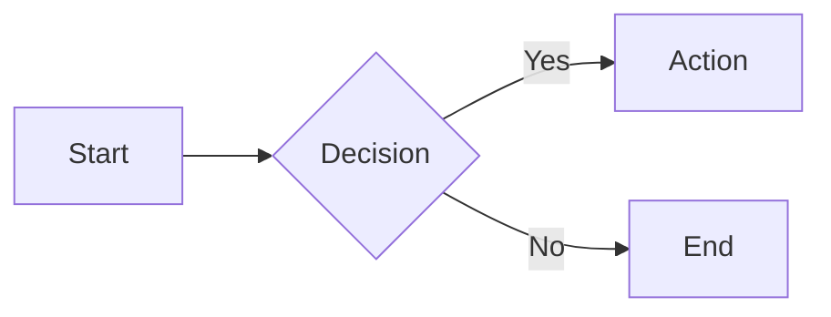
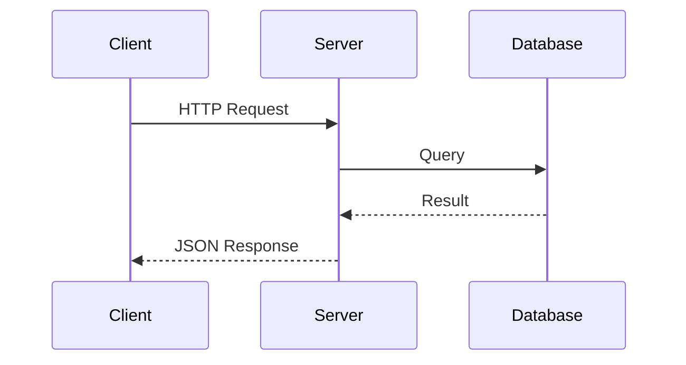
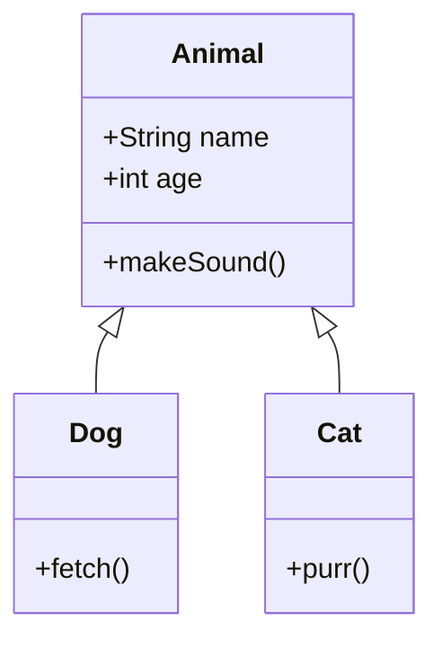
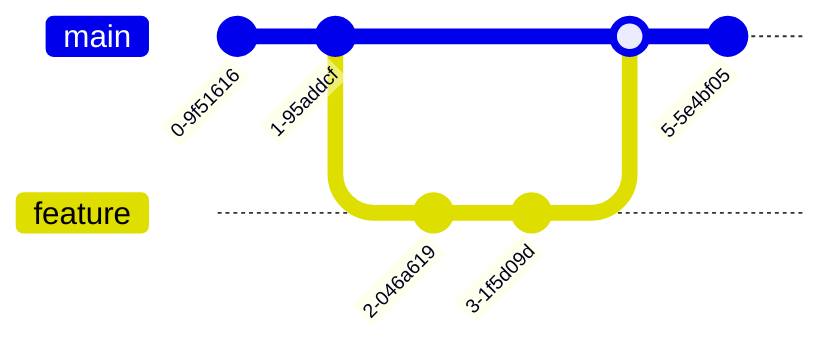

# Mermaid Diagrams

Create diagrams directly in your documentation using `mermaid` fenced code blocks. Diagrams are rendered client-side with [Mermaid](https://mermaid.js.org/) and automatically adapt to light and dark mode.

## Basic usage

````mdx

````

Renders as:


## Examples

### Sequence diagram

````mdx

````


### Class diagram

````mdx

````


### Git graph

````mdx

````



## Dark mode

Mermaid diagrams automatically switch between `default` and `dark` themes based on the current color mode. No additional configuration is needed.

## How it works

The `remarkCodeBlocks` remark plugin intercepts code blocks with `mermaid` as the language before Shiki processes them. The diagram definition is passed to a `MermaidBlock` React component hydrated with `client:load`. On mount, it dynamically imports the Mermaid library, renders the diagram to SVG, and displays it. A `<pre>` placeholder is shown before hydration.

:::callout{variant="info"}
Mermaid supports many diagram types including flowcharts, sequence diagrams, class diagrams, state diagrams, ER diagrams, Gantt charts, and more. See the [Mermaid documentation](https://mermaid.js.org/intro/) for a full reference.
:::
