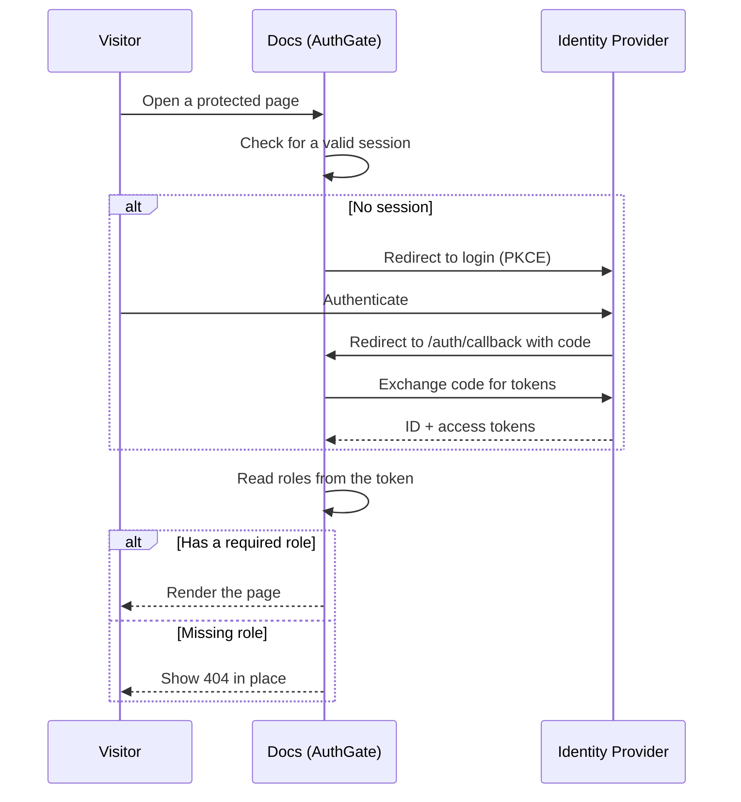

# Authentication

Explainer can gate any documentation page behind single sign-on. Authentication is **opt-in** — without configuration your docs stay fully static and public. Once enabled, protected pages require a valid session from your OpenID Connect (OIDC) provider, and you can narrow access further by role.

## How it works

Authentication runs entirely in the browser using the OIDC **Authorization Code flow with PKCE** — there is no backend and no client secret. A small React island (`AuthGate`) checks the session when a protected page loads and drives the login redirect, token exchange, and role check.



:::callout{variant="info"}
The session is restored silently on later visits, so authenticated users are not prompted again until their session expires.
:::

## Enabling authentication

Authentication is configured through environment variables. At minimum you turn it on and point it at your provider.

::::step-group
:::step{title="Set the environment variables"}
Add these to your `.env` (or deployment environment). Every variable is prefixed with `PUBLIC_` because it is read in the browser.

```bash [.env]
PUBLIC_AUTH_ENABLED=true
PUBLIC_OIDC_ISSUER=https://id.example.com/realms/my-realm
PUBLIC_OIDC_CLIENT_ID=docs
```

`PUBLIC_OIDC_ISSUER` and `PUBLIC_OIDC_CLIENT_ID` are required when auth is enabled — the build fails fast if either is missing.
:::

:::step{title="Register the client with your provider"}
Create a **public** client (PKCE, no secret) and allow these redirect URIs:

- `https://docs.example.com/auth/callback` — login callback
- `https://docs.example.com/auth/silent` — silent token renewal
- `https://docs.example.com/` — post-logout redirect
:::

:::step{title="Protect a page"}
Add an `auth` block to a page's frontmatter (see below) and rebuild. The page now requires a signed-in user.
:::
::::

:::callout{variant="warning"}
Never put a client secret in a `PUBLIC_` variable — these values are bundled into the browser. The flow is a public PKCE client by design and needs no secret.
:::

### Optional settings

Sensible defaults cover most setups; override only what you need.

| Variable | Default | Purpose |
|----------|---------|---------|
| `PUBLIC_OIDC_ROLES_CLAIM` | `realm_access.roles` | Dot-path to the roles array in the token |
| `PUBLIC_OIDC_SCOPE` | `openid profile email` | Requested scopes |
| `PUBLIC_OIDC_REDIRECT_URI` | `/auth/callback` | Where the provider returns after login |
| `PUBLIC_OIDC_POST_LOGOUT_REDIRECT_URI` | `/` | Where to land after logout |
| `PUBLIC_OIDC_AUDIENCE` | — | Audience to request, if your provider needs it |

## Protecting a page

Add an `auth` block to the page frontmatter:

```yaml [my-page.mdx]
---
title: Internal Notes
auth:
  enabled: true
---
```

With `enabled: true` and no roles listed, **any authenticated user** can read the page.

### Protecting a whole folder

To protect every page in a folder, put the same `auth` block in the folder's `_meta.json`. Pages inherit it unless they declare their own:

```json [_meta.json]
{
  "title": "Internal",
  "auth": {
    "enabled": true,
    "roles": ["staff"]
  }
}
```

Precedence is **page frontmatter → nearest parent folder `_meta.json` → public**.

## Restricting by role

List the roles a page accepts. A visitor needs **at least one** of them:

```yaml
auth:
  enabled: true
  roles:
    - admin
    - editor
```

The outcome depends on the visitor's state:

| Visitor | Result |
|---------|--------|
| Not signed in | Redirected to the login flow |
| Signed in, has a listed role | Page renders |
| Signed in, missing every role | A 404 is shown in place (no redirect) |

:::callout{variant="info"}
Roles are read from the token at the path set by `PUBLIC_OIDC_ROLES_CLAIM`. For Keycloak-style realm roles that is `realm_access.roles`; for client roles use `resource_access.<client-id>.roles`.
:::

## Try it

::::card-group{cols=2}
:::card{label="Protected Page (demo)" icon="lucide:lock" href="/en/explainer/protected"}
A live example gated behind the `admin` role. Sign in to view it, or see the 404-in-place behavior when your account lacks the role.
:::

:::card{label="Pages & Frontmatter" icon="lucide:file-text" href="/en/explainer/writing-content/pages-and-frontmatter"}
The full frontmatter reference, including where the `auth` block fits.
:::
::::
