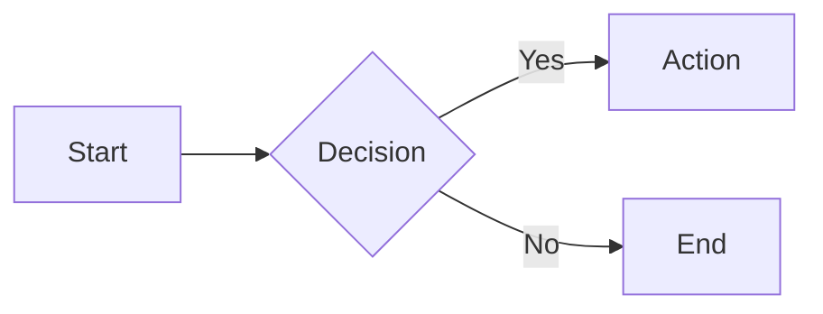
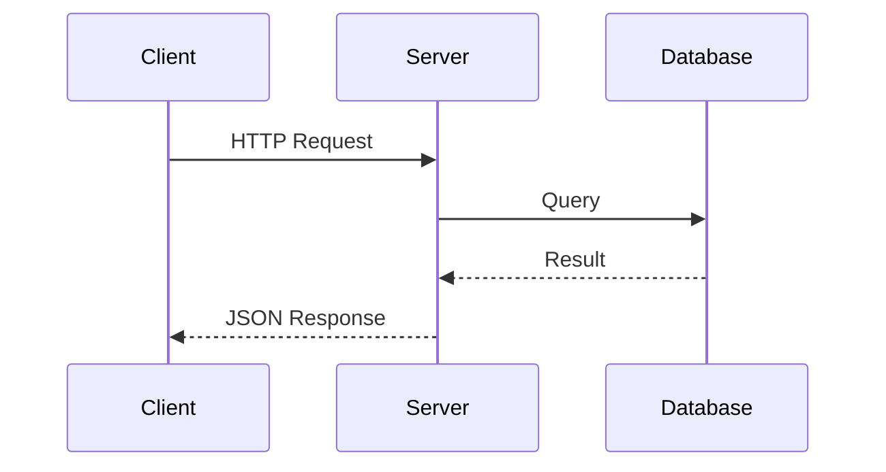
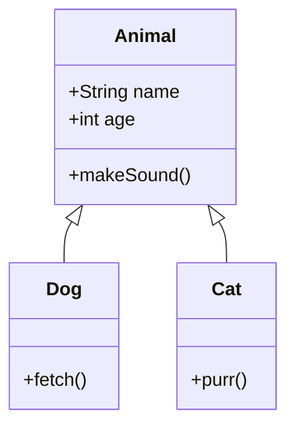
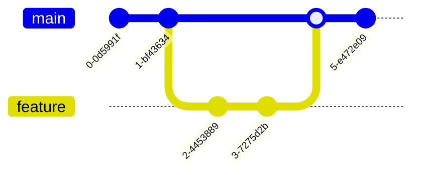

# Diagrammes Mermaid

Créez des diagrammes directement dans votre documentation en utilisant les blocs de code `mermaid`. Les diagrammes sont rendus côté client avec [Mermaid](https://mermaid.js.org/) et s'adaptent automatiquement aux modes clair et sombre.

## Utilisation de base

````mdx

````

Rendu :


## Exemples

### Diagramme de séquence

````mdx

````


### Diagramme de classes

````mdx

````


### Graphe Git

````mdx

````


## Mode sombre

Les diagrammes Mermaid basculent automatiquement entre les thèmes `default` et `dark` en fonction du mode de couleur actuel. Aucune configuration supplémentaire n'est nécessaire.

## Fonctionnement

Le plugin remark `remarkCodeBlocks` intercepte les blocs de code avec `mermaid` comme langage avant que Shiki ne les traite. La définition du diagramme est transmise à un composant React `MermaidBlock` hydraté avec `client:load`. Au montage, il importe dynamiquement la bibliothèque Mermaid, effectue le rendu du diagramme en SVG et l'affiche. Un élément `<pre>` est affiché comme placeholder avant l'hydratation.

:::callout{variant="info"}
Mermaid prend en charge de nombreux types de diagrammes, notamment les organigrammes, les diagrammes de séquence, les diagrammes de classes, les diagrammes d'état, les diagrammes ER, les diagrammes de Gantt, et bien d'autres. Consultez la [documentation Mermaid](https://mermaid.js.org/intro/) pour une référence complète.
:::
