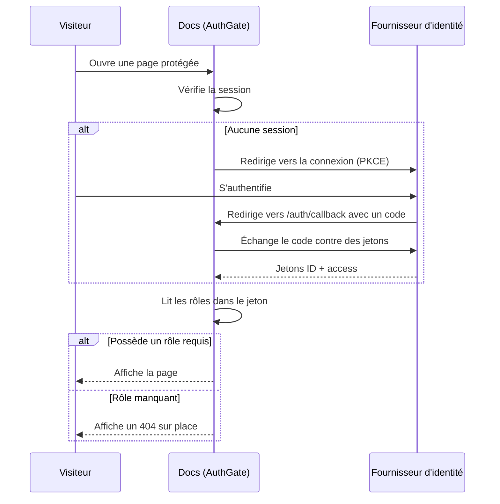

# Authentification

Explainer peut verrouiller n'importe quelle page de documentation derrière une authentification unique (SSO). L'authentification est **optionnelle** — sans configuration, votre documentation reste entièrement statique et publique. Une fois activée, les pages protégées exigent une session valide auprès de votre fournisseur OpenID Connect (OIDC), et vous pouvez restreindre davantage l'accès par rôle.

## Fonctionnement

L'authentification s'exécute entièrement dans le navigateur via le flux OIDC **Authorization Code avec PKCE** — sans backend ni secret client. Un petit îlot React (`AuthGate`) vérifie la session au chargement d'une page protégée et orchestre la redirection de connexion, l'échange de jetons et la vérification du rôle.



:::callout{variant="info"}
La session est restaurée silencieusement lors des visites suivantes : les utilisateurs authentifiés ne sont plus sollicités tant que leur session n'a pas expiré.
:::

## Activer l'authentification

L'authentification se configure via des variables d'environnement. Au minimum, vous l'activez et indiquez votre fournisseur.

::::step-group
:::step{title="Définir les variables d'environnement"}
Ajoutez-les à votre `.env` (ou à l'environnement de déploiement). Chaque variable porte le préfixe `PUBLIC_` car elle est lue dans le navigateur.

```bash [.env]
PUBLIC_AUTH_ENABLED=true
PUBLIC_OIDC_ISSUER=https://id.example.com/realms/my-realm
PUBLIC_OIDC_CLIENT_ID=docs
```

`PUBLIC_OIDC_ISSUER` et `PUBLIC_OIDC_CLIENT_ID` sont obligatoires lorsque l'authentification est activée — le build échoue immédiatement si l'une manque.
:::

:::step{title="Déclarer le client chez votre fournisseur"}
Créez un client **public** (PKCE, sans secret) et autorisez ces URI de redirection :

- `https://docs.example.com/auth/callback` — retour de connexion
- `https://docs.example.com/auth/silent` — renouvellement silencieux des jetons
- `https://docs.example.com/` — redirection après déconnexion
:::

:::step{title="Protéger une page"}
Ajoutez un bloc `auth` au frontmatter d'une page (voir ci-dessous) et relancez le build. La page exige désormais un utilisateur connecté.
:::
::::

:::callout{variant="warning"}
Ne placez jamais de secret client dans une variable `PUBLIC_` — ces valeurs sont intégrées au bundle navigateur. Le flux est un client public PKCE par conception et n'a besoin d'aucun secret.
:::

### Paramètres optionnels

Les valeurs par défaut conviennent à la plupart des cas ; ne surchargez que le nécessaire.

| Variable | Défaut | Rôle |
|----------|--------|------|
| `PUBLIC_OIDC_ROLES_CLAIM` | `realm_access.roles` | Chemin pointé vers le tableau des rôles dans le jeton |
| `PUBLIC_OIDC_SCOPE` | `openid profile email` | Scopes demandés |
| `PUBLIC_OIDC_REDIRECT_URI` | `/auth/callback` | Où le fournisseur renvoie après connexion |
| `PUBLIC_OIDC_POST_LOGOUT_REDIRECT_URI` | `/` | Où atterrir après déconnexion |
| `PUBLIC_OIDC_AUDIENCE` | — | Audience à demander, si votre fournisseur l'exige |

## Protéger une page

Ajoutez un bloc `auth` au frontmatter de la page :

```yaml [my-page.mdx]
---
title: Notes internes
auth:
  enabled: true
---
```

Avec `enabled: true` et aucun rôle listé, **tout utilisateur authentifié** peut lire la page.

### Protéger un dossier entier

Pour protéger toutes les pages d'un dossier, placez le même bloc `auth` dans le `_meta.json` du dossier. Les pages en héritent, sauf si elles déclarent le leur :

```json [_meta.json]
{
  "title": "Interne",
  "auth": {
    "enabled": true,
    "roles": ["staff"]
  }
}
```

La précédence est : **frontmatter de la page → `_meta.json` du dossier parent le plus proche → public**.

## Restreindre par rôle

Listez les rôles acceptés par une page. Un visiteur doit en posséder **au moins un** :

```yaml
auth:
  enabled: true
  roles:
    - admin
    - editor
```

Le résultat dépend de l'état du visiteur :

| Visiteur | Résultat |
|----------|----------|
| Non connecté | Redirigé vers le flux de connexion |
| Connecté, possède un rôle listé | La page s'affiche |
| Connecté, sans aucun des rôles | Un 404 est affiché sur place (sans redirection) |

:::callout{variant="info"}
Les rôles sont lus dans le jeton au chemin défini par `PUBLIC_OIDC_ROLES_CLAIM`. Pour les rôles de realm façon Keycloak, c'est `realm_access.roles` ; pour les rôles de client, utilisez `resource_access.<client-id>.roles`.
:::

## Essayer

::::card-group{cols=2}
:::card{label="Page protégée (démo)" icon="lucide:lock" href="/fr/explainer/protected"}
Un exemple en conditions réelles verrouillé derrière le rôle `admin`. Connectez-vous pour la voir, ou observez le comportement « 404 sur place » lorsque votre compte n'a pas le rôle.
:::

:::card{label="Pages & Frontmatter" icon="lucide:file-text" href="/fr/explainer/writing-content/pages-and-frontmatter"}
La référence complète du frontmatter, y compris la place du bloc `auth`.
:::
::::
